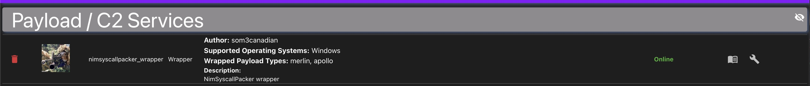
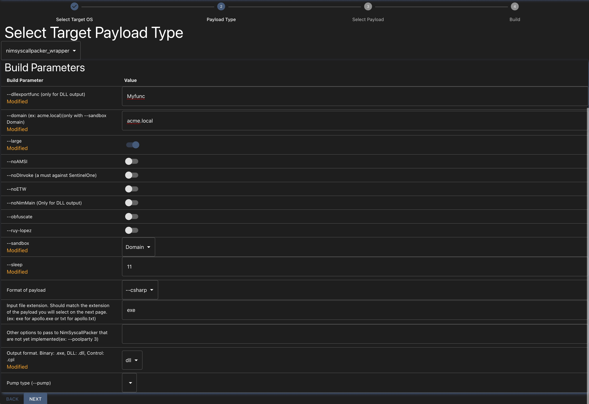
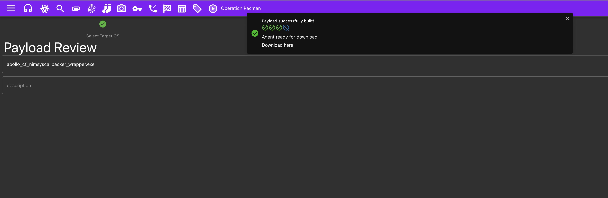

# Mythic_NimSyscallPacker_Wrapper

## Description

Mythic C2 wrapper for NimSyscallPacker. This is similar to the [scarescrow_wrapper](https://github.com/MythicAgents/scarecrow_wrapper) but for NimSyscallPacker made by S3cur3Th1sSh1t (sponsors only). So yeah, to use this wrapper you need to be a [sponsor of S3cur3Th1sSh1t](https://github.com/sponsors/S3cur3Th1sSh1t).







## Requirements

- Having Mythic installed and running
- Having an agent installed and working (ex: apollo)
- You are being able to generate a payload (ex: apollo csharp payload), run it on a target machine and receive a callback.
- Being a [sponsor of S3cur3Th1sSh1t](https://github.com/sponsors/S3cur3Th1sSh1t)

## Usage

### Install and setup NimSyscallPacker wrapper

**Make sure your version of Mythic is v3.3.1-rc20 or higher.**

First step is to install the NimSyscallPacker wrapper in your Mythic instance.

```bash
git clone https://github.com/som3canadian/Mythic_NimSyscallPacker_Wrapper.git nimsyscallpacker_wrapper
cd ./Payload_Type/nimsyscallpacker_wrapper/agent_code
#
# git clone NimSyscallPacker from S3cur3Th1sSh1t private repo
git clone git@github.com:S3cur3Th1sSh1t...
#
# go in the path where you can you run mythic-cli
cd /path/to/mythic
./mythic-cli install folder /path/to/repo/agents/nimsyscallpacker_wrapper
```

At this point you should be able to see the packer in the Mythic UI and create a payload using the new wrapper. You need to create a payload first (apollo or merlin).

## Todo

- [ ] Add support for more agents (I only tested with apollo and merlin)
- [ ] Integrate more options (build parameters) in the wrapper
- [ ] Manage more formats (pwsh, xll, etc)
- [ ] Better documentation

## Credits

- [S3cur3Th1sSh1t](https://github.com/S3cur3Th1sSh1t)
- [its-a-feature](https://github.com/its-a-feature)
